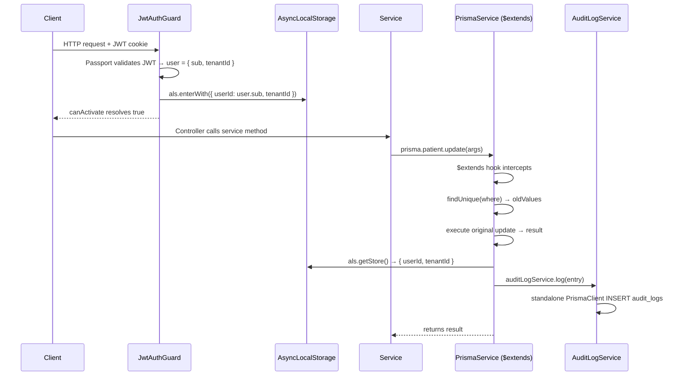

# Design: AsyncLocalStorage Context Manager + Prisma Audit Log Middleware

## Technical Approach

Create `RequestContextModule` to store `{ userId, tenantId }` in `AsyncLocalStorage` and register a Prisma query extension (Prisma 7 / `$extends`) in `PrismaService.onModuleInit()` that intercepts mutations on audited models and writes `AuditLog` rows. Circular dependency is broken by giving `AuditLogService` its own standalone `PrismaClient` instance (no NestJS injection of `PrismaService`).

---

## Architecture Decisions

### Decision 1: NestJS Middleware vs Guard Extension for Context Population

| Option | Tradeoff | Decision |
|--------|----------|----------|
| `NestJS Middleware` runs before guards | `req.user` is NOT set yet when middleware fires; context would be empty | ❌ Rejected |
| Extend `JwtAuthGuard.handleRequest()` | Runs after Passport validates JWT; `user` is available; single override | ✅ Chosen |
| Separate `@Injectable()` guard after JWT | Requires two global guards and ordering contract | ❌ Rejected |

**Rationale**: In NestJS, the pipeline order is `Middleware → Guards → Interceptors`. `APP_GUARD` (JwtAuthGuard) populates `req.user` inside `canActivate()`. Middleware fires before this, so it never sees `req.user`. The cleanest solution is to override `handleRequest()` in `JwtAuthGuard` itself — it receives the validated `user` object and can populate `AsyncLocalStorage` before returning it.

`RequestContextModule` still exports the `AsyncLocalStorage` token so all consumers share the same instance; `JwtAuthGuard` receives it via constructor injection.

### Decision 2: `$use()` vs `$extends` for Prisma Hook

| Option | Tradeoff | Decision |
|--------|----------|----------|
| `$use()` (Prisma middleware) | Removed in Prisma 5+; not available in v7.8 | ❌ Unavailable |
| `$extends` query extension | Prisma 5+ API; available and recommended in v7 | ✅ Chosen |

**Rationale**: `package.json` specifies `@prisma/client: "^7.8.0"`. Prisma dropped `$use()` middleware in v5. The correct API is `this.$extends({ query: { ... } })`. Because `$extends` returns a **new client instance**, we must reassign: the extension is applied in `onModuleInit()` and stored on a property; all service code that touches audited models uses the extended client.

> **Implementation note**: `PrismaClient.$extends()` returns a new typed client. `PrismaService` will store the extended client on `this` by re-extending after connect. NestJS injects `PrismaService`; services call `prisma.patient.create(...)` — this works because `PrismaService extends PrismaClient` and we reassign model delegates post-extension via `Object.assign(this, this.$extends(...))`.

### Decision 3: Breaking the Circular Dependency

| Option | Tradeoff | Decision |
|--------|----------|----------|
| `forwardRef()` between PrismaModule ↔ AuditLogModule | Circular module bootstrap instability; deferred resolution may cause undefined providers | ❌ Rejected |
| `AuditLogService` creates its own `new PrismaClient()` | Standalone client with no NestJS lifecycle binding | ✅ Chosen |
| Event emitter pattern | Decoupled but adds complexity and potential for missed events | ❌ Overkill |

**Rationale**: `AuditLogService` currently injects `PrismaService`. If `PrismaService` also injects `AuditLogService`, the dep graph is circular: `PrismaModule → AuditLogModule → PrismaModule`. The fix: `AuditLogService` drops its `PrismaService` dependency and instantiates a standalone `new PrismaClient({ adapter })` that it manages independently. The `AuditLogModule` must NOT import `PrismaModule`. `AuditLogModule` remains `@Global()` and `PrismaModule` imports it to receive `AuditLogService`.

---

## Data Flow

```
HTTP Request
  │
  ├─► Middleware (passes through — req.user not set yet)
  │
  ├─► JwtAuthGuard.canActivate()
  │     └─► Passport validates JWT → handleRequest(user)
  │               └─► als.enterWith({ userId, tenantId })  ← context stored
  │
  ├─► Controller → Service → prisma.patient.update(...)
  │                               │
  │                               └─► $extends query hook fires
  │                                     ├─► read-before-write (findUnique)
  │                                     ├─► execute original operation
  │                                     ├─► compute changedFields diff
  │                                     └─► auditLogService.log(entry)
  │                                               └─► standalone PrismaClient
  │                                                     └─► INSERT audit_logs
  └─► Response
```

Non-HTTP flows (seeds, cron): `als.getStore()` returns `undefined` → hook skips audit (no throw).

---

## File Changes

| File | Action | Description |
|------|--------|-------------|
| `apps/api/src/common/context/request-context.module.ts` | Create | `@Global()` module that provides `AsyncLocalStorage<RequestContext>` as `REQUEST_CONTEXT` token |
| `apps/api/src/common/context/request-context.interface.ts` | Create | `RequestContext` interface: `{ userId: string; tenantId: string }` |
| `apps/api/src/common/context/request-context.service.ts` | Create | `RequestContextService` wraps ALS: `getStore()`, `enterWith(ctx)`, `run(ctx, fn)` |
| `apps/api/src/common/context/index.ts` | Create | Barrel export |
| `apps/api/src/auth/guards/jwt-auth.guard.ts` | Modify | Inject `RequestContextService`; in `handleRequest()` call `enterWith({ userId, tenantId })` and store context |
| `apps/api/src/auth/auth.module.ts` | Modify | Import `RequestContextModule` so the ALS token is available for `JwtAuthGuard` injection |
| `apps/api/src/audit-log/audit-log.service.ts` | Modify | Remove `PrismaService` dependency; create standalone `PrismaClient` in constructor using `DATABASE_URL` from `ConfigService`; connect in `onModuleInit()` |
| `apps/api/src/audit-log/audit-log.module.ts` | Modify | Import `ConfigModule`; remove `PrismaModule` import (was implicit via global); export `AuditLogService` (already done) |
| `apps/api/src/database/prisma.service.ts` | Modify | Inject `AuditLogService`; in `onModuleInit()`, apply `$extends` query extension for audited models after `$connect()` |
| `apps/api/src/database/prisma.module.ts` | Modify | Import `AuditLogModule` to receive `AuditLogService` |
| `apps/api/src/app.module.ts` | Modify | Import `RequestContextModule` (registers the ALS global token) |

---

## Interfaces / Contracts

```typescript
// request-context.interface.ts
export interface RequestContext {
  userId: string;
  tenantId: string;
}

// ALS injection token
export const REQUEST_CONTEXT = 'REQUEST_CONTEXT';

// Audited models constant (prisma.service.ts)
const AUDITED_MODELS = new Set([
  'Patient', 'Doctor', 'User', 'Specialty', 'Service',
  'ExpenseCategory', 'DoctorBankAccount', 'ExchangeRate', 'SystemConfig',
]);

const AUDITED_OPERATIONS = new Set(['create', 'update', 'updateMany']);

// $extends query hook skeleton (Prisma 7)
this.$extends({
  query: {
    $allModels: {
      async $allOperations({ model, operation, args, query }) {
        if (!AUDITED_MODELS.has(model) || !AUDITED_OPERATIONS.has(operation)) {
          return query(args);
        }
        const ctx = als.getStore(); // undefined on non-HTTP flows
        let oldValues: Record<string, unknown> | undefined;
        if (operation === 'update' && args.where?.id) {
          oldValues = await (this as PrismaClient)[model].findUnique({ where: args.where });
        }
        const result = await query(args);
        if (ctx) {
          const changedFields = oldValues
            ? Object.keys(args.data).filter(k => args.data[k] !== oldValues![k])
            : [];
          await auditLogService.log({
            tenantId: ctx.tenantId,
            userId: ctx.userId,
            action: operation.toUpperCase(),
            entity: model,
            entityId: result?.id ?? 'bulk',
            oldValues: oldValues ?? undefined,
            newValues: args.data,
            changedFields,
          });
        }
        return result;
      },
    },
  },
})

// JwtAuthGuard.handleRequest override
handleRequest<T>(err: Error | null, user: T & { sub: string; tenantId: string }): T {
  if (err || !user) throw err ?? new UnauthorizedException();
  this.als.enterWith({ userId: user.sub, tenantId: user.tenantId });
  return user;
}
```

> **Note**: `enterWith` is used instead of `run()` because `handleRequest` is synchronous and the rest of the request executes in the same call stack (NestJS invokes controller after guard resolves). Verify Node.js version supports `enterWith` (added in Node 16).

---

## Sequence Diagram



---

## Testing Strategy

| Layer | What to Test | Approach |
|-------|-------------|----------|
| Unit | `RequestContextService.getStore()` returns stored value; null-safe on empty store | Jest, mock ALS |
| Unit | Prisma hook: skip non-audited model, skip unauthenticated flow, correct diff for `update` | Jest, mock `query()` fn and ALS |
| Unit | `JwtAuthGuard.handleRequest` populates ALS; throws on null user | Jest, spy on `als.enterWith` |
| Integration | Full request → audit row created with correct `userId`, `tenantId`, `changedFields` | Supertest + test DB |

---

## Risk Register

| Risk | Likelihood | Mitigation |
|------|------------|------------|
| Circular dep `PrismaModule ↔ AuditLogModule` | Med | `AuditLogService` uses standalone `PrismaClient`; `AuditLogModule` must NOT import `PrismaModule`; validated by bootstrap |
| `AsyncLocalStorage` context missing on non-HTTP flows (seeds, cron, queues) | Med | `als.getStore()` check: if `undefined`, skip audit silently — never throw |
| `updateMany` without per-row entity IDs | Med | `entityId = 'bulk'`; `oldValues = undefined`; `newValues = args.data`; limitation documented |
| `$extends` reassignment breaks NestJS DI type inference | Low | Use `Object.assign(this, this.$extends(...))` in `onModuleInit()`; typed via intersection |
| `AuditLogService` standalone client connection pool overhead | Low | Single additional connection; negligible at current scale; revisit if connection count becomes constraint |

---

## Migration / Rollout

No data migration required. `AuditLog` table already exists in schema with correct fields (`oldValues: Json?`, `newValues: Json?`, `changedFields: String[]`). Change is purely additive — no schema changes, no API changes, no call-site changes.

Rollback: remove `$extends` block from `PrismaService.onModuleInit()` and revert `JwtAuthGuard.handleRequest()`.

---

## Open Questions

- [ ] Confirm Node.js runtime version in Docker image supports `AsyncLocalStorage.enterWith()` (requires Node ≥ 16; check `Dockerfile`).
- [x] `Service` model has no `tenantId` directly — audit mutations under the acting request context tenant because `AuditLog.tenantId` is required by the current schema.
- [ ] Verify JWT payload includes `tenantId` field: current `JwtStrategy` returns `{ sub, email, role, permissions, role_version }` per AGENTS.md — `tenantId` must be added to the JWT payload or fetched from the user record in `handleRequest`.
